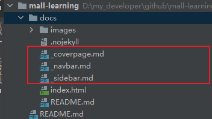
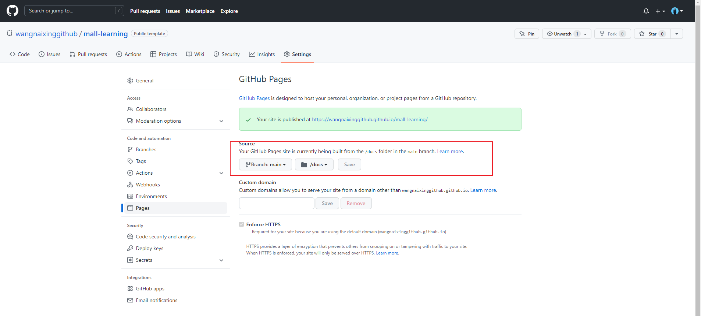

# 想拥有一个个人的文档网站?安排！

> 附上本人文档网站成果：https://github.com/wangnaixinggithub/mall-learning

## 1、准备

- 拥有node.js环境。

- 执行npm 安装命令进行安装Docsify.

```shell
npm i docsify-cli -g
```

## 2、创建网站工程并动态调试

```shell
docsify init ./docs
docsify serve docs
```

此时便可以通过本地IP，4000端口访问到了。http://localhost:3000/

## 3、开始设计吧

- 创建如下三个Markdown文件。分别表示封面页，导航栏，以及侧边栏。




- 配置三个文件的内容

```markdown
# _coverpage.md
  
  # mall-learning
  > mall学习教程，架构、业务、技术要点全方位解析。

  此处填写详细简介。
  [GitHub](https://github.com/macrozheng/mall-learning)
  [Get Started](README.md)
# _navbar.md  
* 演示
    * [后台管理](http://39.98.190.128/index.html)
    * [移动端](http://39.98.190.128/mall-app/mainpage.html)
* 项目地址
    * [后台项目](https://github.com/macrozheng/mall)
    * [前端项目](https://github.com/macrozheng/mall-admin-web)
    * [学习教程](https://github.com/macrozheng/mall-learning)
# _sidebar.md	   
* 序章
  * [mall架构及功能概览](foreword/mall_foreword_01.md)
  * [mall学习所需知识点](foreword/mall_foreword_02.md)
* 架构篇
  * [mall整合SpringBoot+MyBatis搭建基本骨架](architect/mall_arch_01.md)
  * [mall整合Swagger-UI实现在线API文档](architect/mall_arch_02.md)	
```

- 在index.html配置

> 本人还配置了全文检索，代码高亮，一键复制的功能。

```java
<!DOCTYPE html>
<html lang="en">
<head>
  <meta charset="UTF-8">
  <title>Document</title>
  <meta http-equiv="X-UA-Compatible" content="IE=edge,chrome=1" />
  <meta name="description" content="Description">
  <meta name="viewport" content="width=device-width, initial-scale=1.0, minimum-scale=1.0">
  <link rel="stylesheet" href="//cdn.jsdelivr.net/npm/docsify@4/lib/themes/vue.css">
</head>
<body>
  <div id="app"></div>
  <script>
    window.$docsify = {
      name: '',
      repo: '',

      /*配置侧边栏*/
      loadSidebar: true,
      maxLevel: 2,
      subMaxLevel: 4,
      /*配置侧边栏*/

      /*配置导航栏*/
      loadNavbar: true,
      /*配置导航栏*/

      /*定制封面页*/
      coverpage: true,
      /*定制封面页*/

      /*添加全文搜索*/
      search: {
        placeholder: '搜索',
        noData: '找不到结果!',
        depth: 3
      },
      /*添加全文搜索*/

      alias: {
        '/.*/_sidebar.md': '/_sidebar.md',
        '/.*/_navbar.md': '/_navbar.md'//防止意外回退
      }
    }
  </script>

  <!--Docsify的核心配置 -->
  <script src="//cdn.jsdelivr.net/npm/docsify@4"></script>

  <!--添加代码高亮-->
  <script src="//unpkg.com/prismjs/components/prism-bash.js"></script>
  <script src="//unpkg.com/prismjs/components/prism-java.js"></script>
  <script src="//unpkg.com/prismjs/components/prism-sql.js"></script>


  <!--添加一键拷贝代码-->
  <script src="//unpkg.com/docsify-copy-code"></script>

</body>
</html>
```

## 4、提交Github，激活Github Pages环境

